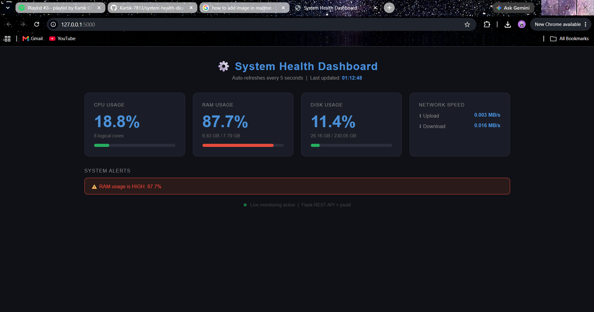

# System Health Monitoring Dashboard

A real-time system health monitoring web application built with **Python and Flask**.  
Tracks CPU, RAM, Disk, and Network metrics via REST API — auto-refreshes every 5 seconds.

## Features

- Real-time CPU, RAM, Disk, and Network monitoring
- REST API endpoint `/api/metrics` returns live JSON data
- Threshold-based alert system — triggers warnings when usage is critical
- Progress bars with color indicators (Green → Yellow → Red)
- Auto-refreshing dashboard — no page reload needed
- Request logging to `monitor.log` with timestamps
- Health check endpoint `/api/status` for deployment monitoring
- Deployable on Render cloud platform

## Project Structure

```
system_health_dashboard/
│
├── app.py                  # Flask app — routes, psutil metrics, alerting
├── requirements.txt        # Project dependencies
├── monitor.log             # Auto-generated request log
└── templates/
    └── index.html          # Dashboard UI — HTML, CSS, JavaScript
```

## How to Run

```bash
# Clone the repository
git clone https://github.com/yourusername/system-health-dashboard.git
cd system-health-dashboard

# Install dependencies
pip install -r requirements.txt

# Run the app
python app.py
```

Then open your browser and visit:
```
http://127.0.0.1:5000
```

## API Endpoints

| Endpoint | Method | Description |
|----------|--------|-------------|
| `/` | GET | Serves the dashboard UI |
| `/api/metrics` | GET | Returns all system metrics as JSON |
| `/api/status` | GET | Health check — returns server status |

## Dashboard Output



## Alert Thresholds

| Metric | Alert Threshold |
|--------|----------------|
| CPU | Above 80% |
| RAM | Above 80% |
| Disk | Above 90% |

## Technologies Used

| Technology | Purpose |
|------------|---------|
| `Flask` | Web framework — routing, REST API, template rendering |
| `psutil` | System metrics — CPU, RAM, disk, network |
| `logging` | Request logging to monitor.log |
| `JavaScript fetch()` | Polls /api/metrics every 5 seconds |
| `HTML/CSS` | Dashboard UI with progress bars and alerts |

## How It Works

1. Flask serves the dashboard HTML page at `/`
2. JavaScript calls `/api/metrics` every 5 seconds using `fetch()`
3. Flask collects live metrics using `psutil`
4. Metrics are returned as JSON and rendered on the dashboard
5. If any metric exceeds threshold → alert is displayed
6. Every API request is logged to `monitor.log` with timestamp

